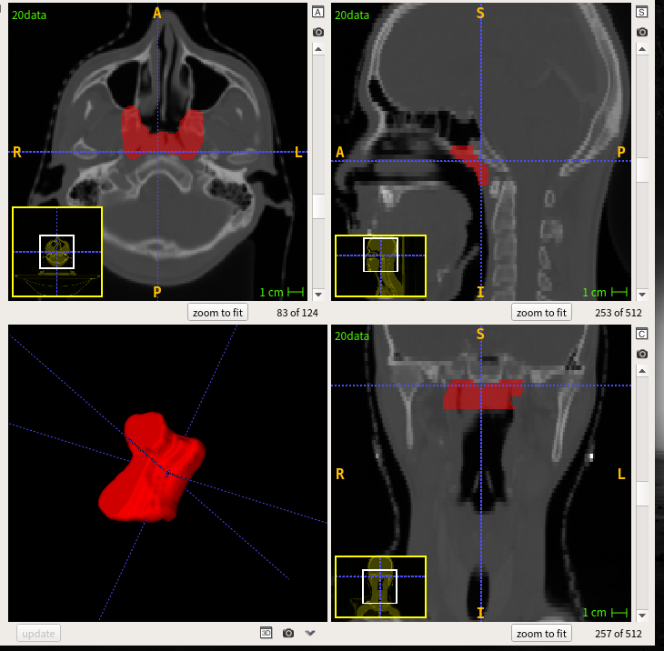

# Automatic segmentation of NPC GTV from CT images

 

This repository proivdes source code for automatic segmentation of Gross Target Volume (GTV) of Nasopharynx Cancer (NPC) from CT images according to the following paper:

* [1] Haochen Mei, Wenhui Lei, Ran Gu, Shan Ye, Zhengwentai Sun, Shichuan Zhang and Guotai Wang. "Automatic Segmentation of Gross Target Volume of Nasopharynx Cancer using Ensemble of Multiscale Deep Neural Networks with Spatial Attention." NeuroComputing (under review). 2020.

# Requirement
* Pytorch version >=0.4.1
* TensorboardX to visualize training performance
* Some common python packages such as Numpy, Pandas, SimpleITK

# Usage
In this repository, we use 2.5D U-Net to segment Gross Target Volume (GTV) of Nasopharynx Cancer (NPC) from CT images. First we download the images from internet, then edit the configuration file for training and testing. During training, we use tensorboard to observe the performance of the network at different iterations. We then apply the trained model to testing images and obtain quantitative evaluation results.

## Install PyMIC
Run the following command to install PyMIC:

```bash
pip install PYMIC
```
## Data and preprocessing
1. The dataset can be downloaded from StructSeg2019 Challenge. It consists of 50 CT images of GTV. Download the images and save them in to a single folder. 
2. Preprocess the data according to your needs and then save the images and annotations to a single folder respectively, like `GTV_root/data` and `GTV_root/label`.
3. Set `GTV_root` according to your computer in `write_csv_files.py` and run `python write_csv_files.py` to randomly split the 50 images into training (40), validation (10) and testing (10) sets. The validation set and testing set are the same in our experimental setting. The output csv files are saved in `config`.

## Training
1. Set the value of `root_dir` as your `GTV_root` in `config/train_test.cfg`. Add the path of `PyMIC` to `PYTHONPATH` environment variable (if you haven't done this). Then you can start trainning by running following command:
 
```bash
python ../../pymic/train_infer/train_infer.py train config/train_test.cfg
```

2. During training or after training, run the command `tensorboard --logdir model/2D5unet` and then you will see a link in the output, such as `http://your-computer:6006`. Open the link in the browser and you can observe the average Dice score and loss during the training stage. 

## Testing and evaluation
1. After training, run the following command to obtain segmentation results of your testing images:

```bash
mkdir result
python ../../pymic/train_infer/train_infer.py test config/train_test.cfg
```

2. Then replace `ground_truth_folder` with your own `GTV_root/label` in `config/evaluation.cfg`, and run the following command to obtain quantitative evaluation results in terms of dice. 

```bash
python ../../pymic/util/evaluation.py config/evaluation.cfg
```

You can also set `metric = assd` in `config/evaluation.cfg` and run the evaluation command again. You will get average symmetric surface distance (assd) evaluation results.
